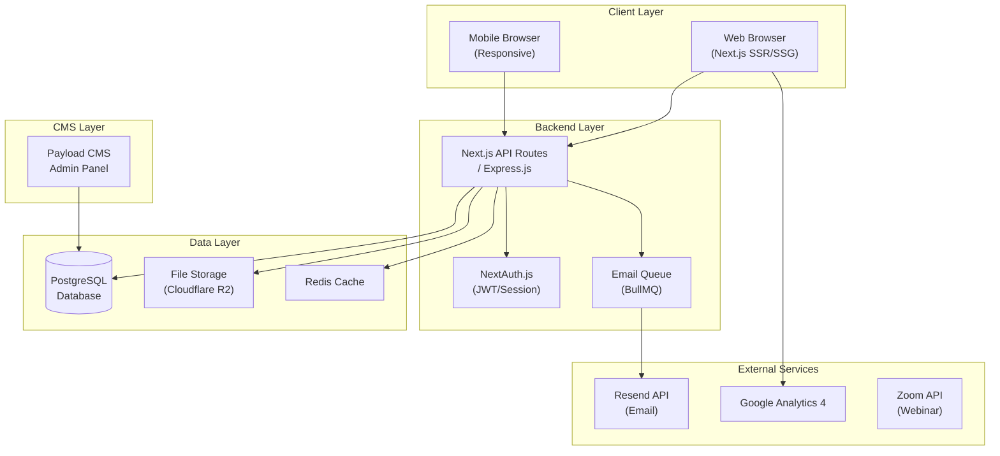
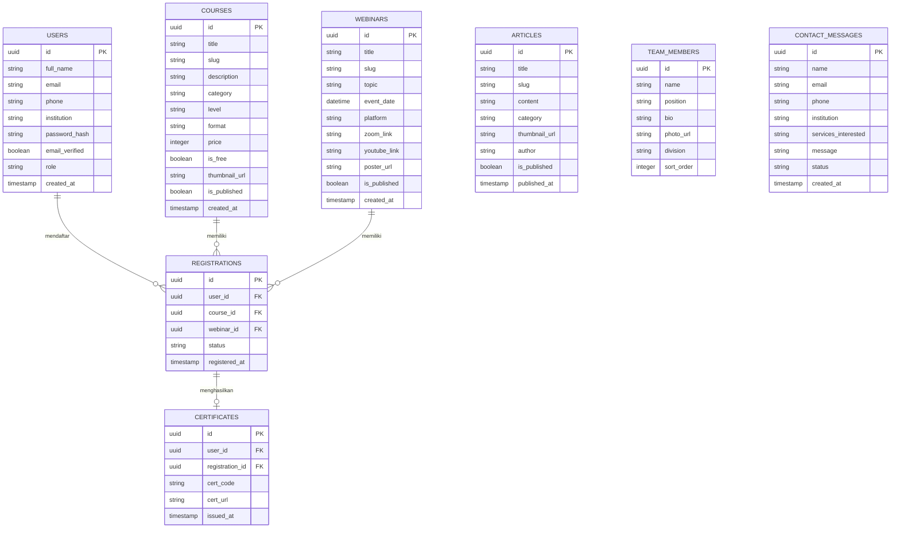

# FSD — Functional Specification Document
## Website PT Mahaga Widya Cita

**Versi:** 1.0.0  
**Tanggal:** 9 Juli 2026  
**Penyusun:** Tim Teknis  
**Referensi PRD:** PRD v1.0.0  

---

## 1. Arsitektur Sistem



---

## 2. Sitemap Website

```
mahagawidyacita.co.id/
├── / (Homepage)
├── /tentang-kami
│   ├── /tentang-kami/profil
│   ├── /tentang-kami/manajemen
│   ├── /tentang-kami/tenaga-ahli
│   ├── /tentang-kami/mitra
│   └── /tentang-kami/pesan-ceo
├── /layanan
│   ├── /layanan/konsultasi
│   ├── /layanan/executive-education
│   ├── /layanan/software
│   ├── /layanan/governance-review
│   ├── /layanan/online-course
│   └── /layanan/digital-conference
├── /kursus
│   ├── /kursus (Listing)
│   └── /kursus/[slug] (Detail)
├── /webinar
│   ├── /webinar (Listing Smart Discussion Series)
│   └── /webinar/[slug] (Detail)
├── /artikel
│   ├── /artikel (Listing)
│   ├── /artikel/individu
│   ├── /artikel/bisnis
│   ├── /artikel/pemerintah
│   ├── /artikel/policy-review
│   └── /artikel/[slug] (Detail)
├── /karir
│   ├── /karir (Listing)
│   └── /karir/[slug] (Detail Lowongan)
├── /kontak
├── /auth
│   ├── /auth/login
│   ├── /auth/register
│   └── /auth/forgot-password
└── /dashboard (Protected)
    ├── /dashboard/profil
    ├── /dashboard/kursus-saya
    ├── /dashboard/webinar-saya
    └── /dashboard/sertifikat
```

---

## 3. Spesifikasi Fungsional Per Modul

---

### 3.1 Modul: Homepage

**Tujuan:** Halaman pertama yang dilihat pengunjung. Harus menampilkan identitas perusahaan, layanan utama, dan ajakan bertindak (CTA) yang kuat.

**Komponen UI:**

| Seksi | Deskripsi | Komponen |
|---|---|---|
| **Navbar** | Menu navigasi tetap (sticky) di atas | Logo, menu item, CTA tombol "Hubungi Kami" |
| **Hero Section** | Banner utama dengan headline dan subheadline | Background gambar/video, 2 tombol CTA |
| **Stats Counter** | Angka pencapaian perusahaan (animasi hitung naik) | Mitra, Kursus, Peserta Webinar, Instansi |
| **Our Services** | Grid kartu 3x2 berisi layanan utama | Ikon, judul, deskripsi singkat, tombol |
| **Latest Articles** | 3–6 artikel terbaru | Thumbnail, kategori badge, judul, tanggal |
| **Upcoming Webinar** | 2–3 webinar mendatang | Tanggal, topik, tombol daftar |
| **Our Team** | Carousel foto tim manajemen kunci | Foto, nama, jabatan |
| **Partners Logo** | Grid logo mitra/klien | Carousel atau grid masonry |
| **Testimonials** | Kutipan dari klien/peserta | Foto, nama, instansi, kutipan |
| **CTA Banner** | Banner ajakan konsultasi | Teks bold + tombol WhatsApp |
| **Footer** | Navigasi footer, sosial media, newsletter, alamat | 4 kolom |

**Behavior:**
- Stats counter akan mulai berhitung ketika elemen memasuki viewport (IntersectionObserver).
- Navbar berubah warna/background saat di-scroll ke bawah (scroll-aware).
- Hero Section mendukung background video atau animasi Lottie.

---

### 3.2 Modul: Autentikasi Pengguna

**3.2.1 Halaman Registrasi (`/auth/register`)**

**Form Fields:**

| Field | Tipe | Validasi |
|---|---|---|
| Nama Lengkap | Text | Required, min 3 karakter |
| Email | Email | Required, format email valid, unik di DB |
| Nomor HP | Tel | Required, format Indonesia (+62/08xx) |
| Instansi/Perusahaan | Text | Optional |
| Password | Password | Required, min 8 karakter, 1 huruf besar, 1 angka |
| Konfirmasi Password | Password | Required, harus sama dengan Password |

**Alur:**
1. Pengguna mengisi form → klik "Daftar"
2. Sistem validasi input (client-side + server-side)
3. Jika valid → buat akun di database → kirim email verifikasi
4. Pengguna klik link verifikasi → akun aktif → redirect ke `/dashboard`
5. Jika email sudah terdaftar → tampil pesan error "Email sudah digunakan"

---

**3.2.2 Halaman Login (`/auth/login`)**

| Field | Tipe | Validasi |
|---|---|---|
| Email | Email | Required |
| Password | Password | Required |

**Alur:**
1. Pengguna isi email + password → klik "Masuk"
2. Sistem verifikasi kredensial
3. Jika valid → buat session JWT → redirect ke halaman sebelumnya / `/dashboard`
4. Jika tidak valid → tampil error "Email atau password salah" (max 5 percobaan, lalu temporary lock 15 menit)
5. Tersedia opsi **"Masuk dengan Google"** (OAuth)

---

### 3.3 Modul: Kursus Online

**3.3.1 Halaman Listing Kursus (`/kursus`)**

**Filter & Sort:**

| Filter | Opsi |
|---|---|
| Kategori | Tata Kelola, Manajemen Risiko, Keuangan Daerah, Perencanaan, SDM, Teknologi |
| Level | Dasar, Menengah, Lanjutan |
| Format | Online, Offline, Hybrid |
| Status | Tersedia, Segera Hadir |

**Kartu Kursus berisi:**
- Thumbnail kursus
- Badge kategori & level
- Judul kursus
- Instruktur/Narasumber
- Durasi & jumlah modul
- Rating (jika ada)
- Harga (Gratis / Rp xxx.xxx)
- Tombol "Lihat Detail"

---

**3.3.2 Halaman Detail Kursus (`/kursus/[slug]`)**

**Tab Konten:**
1. **Overview** — Deskripsi kursus, tujuan pembelajaran, siapa yang cocok
2. **Kurikulum** — Daftar modul dan sub-topik (accordion)
3. **Instruktur** — Profil singkat narasumber
4. **Review** — Ulasan peserta (rating + komentar)

**Sidebar berisi:**
- Harga kursus + tombol "Daftar Sekarang"
- Info: durasi, level, format, sertifikat
- Tombol berbagi

**Alur Pendaftaran Kursus:**
1. Pengguna klik "Daftar Sekarang"
2. Jika belum login → redirect ke `/auth/login` dengan return URL
3. Jika sudah login:
   - Kursus gratis → langsung terdaftar, redirect ke halaman materi
   - Kursus berbayar → tampil halaman ringkasan + pilihan metode bayar (v2.0)
4. Sistem kirim email konfirmasi pendaftaran

---

### 3.4 Modul: Webinar & Smart Discussion Series

**3.4.1 Listing Webinar (`/webinar`)**

**Filter:**
- Status: Mendatang, Sedang Berlangsung, Selesai
- Tahun & Bulan
- Topik/Kategori

**Kartu Webinar berisi:**
- Nomor seri (mis: SDS #4 - 2026)
- Tanggal & waktu (format: Kamis, 10 Juli 2026 | 09.00 – 11.00 WIB)
- Thumbnail/poster
- Topik/judul webinar
- Narasumber
- Platform (Zoom / YouTube Live)
- Kuota peserta (untuk webinar dengan kuota)
- Tombol "Daftar" / "Lihat Rekaman"

---

**3.4.2 Detail Webinar (`/webinar/[slug]`)**

Berisi:
- Poster webinar
- Deskripsi topik & agenda
- Profil narasumber & moderator
- Waktu & platform pelaksanaan
- Form pendaftaran inline (nama, email, instansi, jabatan)
- Setelah selesai: embed video rekaman YouTube

**Alur Pendaftaran:**
1. Pengguna isi form → klik "Daftar Webinar"
2. Sistem validasi input
3. Jika valid → simpan ke DB → kirim email konfirmasi berisi link Zoom/YouTube
4. Setelah webinar selesai → sistem otomatis cek kehadiran (jika integrasi Zoom API aktif) → terbitkan sertifikat

---

### 3.5 Modul: Blog & Policy Review

**3.5.1 Listing Artikel (`/artikel`)**
- Tab navigasi: Semua | Individu | Bisnis | Pemerintah | Policy Review
- Search bar
- Kartu artikel: thumbnail, kategori badge, judul, excerpt, tanggal, estimasi waktu baca

**3.5.2 Detail Artikel (`/artikel/[slug]`)**
- Header artikel: judul H1, meta (penulis, tanggal, kategori, waktu baca)
- Body artikel: rich text (mendukung heading, list, blockquote, tabel, gambar, kode)
- Share buttons: WhatsApp, Twitter/X, LinkedIn, copy link
- Related articles (3 artikel terkait dari kategori sama)
- Komentar (optional, v2.0)

---

### 3.6 Modul: Dashboard Pengguna

**Halaman Dashboard (`/dashboard`)**

| Sub-halaman | Deskripsi |
|---|---|
| **Profil Saya** | Edit data pribadi, foto profil, ganti password |
| **Kursus Saya** | Daftar kursus yang diikuti + progress bar |
| **Webinar Saya** | Riwayat webinar yang diikuti + status kehadiran |
| **Sertifikat Saya** | Daftar sertifikat yang diperoleh + tombol unduh PDF + kode verifikasi |

---

### 3.7 Modul: Sertifikat Digital

**Penerbitan Sertifikat:**
- Triggered otomatis setelah:
  - Kursus: peserta menyelesaikan 100% modul + kuis
  - Webinar: peserta hadir minimal 80% durasi (berdasarkan data Zoom API atau konfirmasi manual)

**Struktur Sertifikat:**
- Logo PT Mahaga Widya Cita
- Nama peserta
- Nama kursus/webinar
- Tanggal penyelesaian
- Nama & tanda tangan instruktur/direktur
- Kode verifikasi unik (QR Code + kode alfanumerik)

**Verifikasi Publik (`/sertifikat/verifikasi?code=XXXX`):**
- Siapapun dapat mengakses halaman verifikasi
- Masukkan kode → tampil data sertifikat (nama, program, tanggal)

---

### 3.8 Modul: Formulir Kontak

**Form Fields:**

| Field | Tipe | Validasi |
|---|---|---|
| Nama Lengkap | Text | Required |
| Email | Email | Required, format valid |
| Nomor HP/WhatsApp | Tel | Required |
| Instansi/Perusahaan | Text | Required |
| Jabatan | Text | Optional |
| Layanan yang Diminati | Dropdown Multi-select | Required |
| Pesan | Textarea | Required, min 20 karakter |

**Alur:**
1. Submit form → validasi client + CAPTCHA (Google reCAPTCHA v3)
2. Simpan ke database tabel `contact_messages`
3. Kirim email notifikasi ke `halo@mahagawidyacita.co.id`
4. Kirim email auto-reply ke pengirim
5. Tampil pesan sukses "Pesan Anda telah kami terima!"

---

## 4. Desain Database (ERD Ringkasan)



---

## 5. Spesifikasi Desain Visual

| Aspek | Spesifikasi |
|---|---|
| **Tipografi Utama** | Plus Jakarta Sans (heading), Inter (body) — dari Google Fonts |
| **Palet Warna Primer** | Biru Navy `#0B2D6B` + Biru Terang `#1E6FD9` |
| **Palet Aksen** | Emas/Gold `#C9970A` untuk highlight premium |
| **Background** | Putih `#FFFFFF` + Abu Muda `#F4F6FA` |
| **Teks** | Gelap `#1A1A2E`, Abu `#6B7280` |
| **Border Radius** | 8px untuk kartu, 4px untuk tombol |
| **Shadow Kartu** | `box-shadow: 0 4px 24px rgba(0,0,0,0.08)` |
| **Animasi Transisi** | 0.3s ease-in-out |
| **Grid Sistem** | 12 kolom, gutter 24px |

---

*Dokumen FSD ini akan dilengkapi dengan wireframe visual dan mockup desain di Fase 1.*
