# Buku Panduan Penggunaan Halaman Admin (CMS)

## PT Mahaga Widya Cita — Panduan Praktis untuk Pengguna Awam

Buku panduan ini disusun khusus agar siapa saja, termasuk pengguna yang masih awam atau belum terbiasa dengan sistem website (_non-teknis_), dapat mengelola, memperbarui, dan mempublikasikan konten di website **Mahaga Widya Cita** dengan mudah, aman, dan percaya diri.

---

## Daftar Isi

1. [Masuk ke Sistem (Login) & Pengenalan Layar](#1-masuk-ke-sistem-login--pengenalan-layar)
2. [Mengenal 4 Menu Utama di Sidebar](#2-mengenal-4-menu-utama-di-sidebar)
3. [Beranda Admin (Dashboard) & Pusat Kontrol 1-Klik](#3-beranda-admin-dashboard--pusat-kontrol-1-klik)
4. [Cara Menulis & Menerbitkan Berita Baru (1-Klik Publish)](#4-cara-menulis--menerbitkan-berita-baru-1-klik-publish)
5. [Fitur Terjemahan Otomatis ke Bahasa Inggris (AI)](#5-fitur-terjemahan-otomatis-ke-bahasa-inggris-ai)
6. [Menambahkan & Mengimpor Jurnal Ilmiah](#6-menambahkan--mengimpor-jurnal-ilmiah)
7. [Mengedit Halaman Website (Beranda, Tentang Kami, Kontak, dll)](#7-mengedit-halaman-website)
8. [Menambahkan Anggota Tim Ahli & Konsultan](#8-menambahkan-anggota-tim-ahli--konsultan)
9. [Mengunggah Foto & Galeri Media](#9-mengunggah-foto--galeri-media)
10. [Melihat Pesan Masuk dari Pengunjung Website](#10-melihat-pesan-masuk-dari-pengunjung-website)
11. [Pusat Bantuan & Tanya Jawab Pemula (FAQ)](#11-pusat-bantuan--tanya-jawab-pemula-faq)

---

## 1. Masuk ke Sistem (Login) & Pengenalan Layar

### Langkah-langkah Masuk:

1. Buka browser (Google Chrome, Safari, atau Edge) di laptop/komputer Anda.
2. Ketik alamat admin: **`https://www.mahagawidyacita.com/admin`** (atau `http://localhost:3000/admin` pada komputer uji coba).
3. Masukkan **Alamat Email** dan **Kata Sandi (Password)** akun Anda.
4. Klik tombol biru **Masuk ke Dashboard**.

> [!TIP]
> **Tips Aman**: Jika Anda bekerja di laptop kantor bersama, pastikan selalu menekan tombol nama Anda di pojok kiri bawah lalu pilih **Keluar (Log Out)** setelah selesai bekerja.

---

## 2. Mengenal 4 Menu Utama di Sidebar

Untuk memudahkan Anda menemukan apa yang ingin diubah, menu di sebelah kiri (sidebar) telah dikelompokkan ke dalam **4 kelompok yang sangat mudah dipahami**:

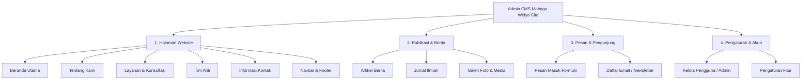

- **🌐 Halaman Website**: Untuk mengganti teks, visi misi, alamat kantor, maupun banner halaman depan persis seperti yang dilihat pengunjung.
- **📰 Publikasi & Berita**: Tempat Anda menulis artikel berita baru, mengunggah jurnal riset, dan melihat koleksi foto.
- **💬 Pesan & Pengunjung**: Berisi pesan yang dikirimkan calon klien lewat formulir kontak serta daftar email langganan newsletter.
- **⚙️ Pengaturan & Akun**: Khusus untuk menambah akun staf/editor baru dan mengatur opsi sistem.

---

## 3. Beranda Admin (Dashboard) & Pusat Kontrol 1-Klik

Begitu Anda berhasil login, Anda akan langsung disambut oleh **Beranda Admin (Dashboard)** yang bersih dan terarah:

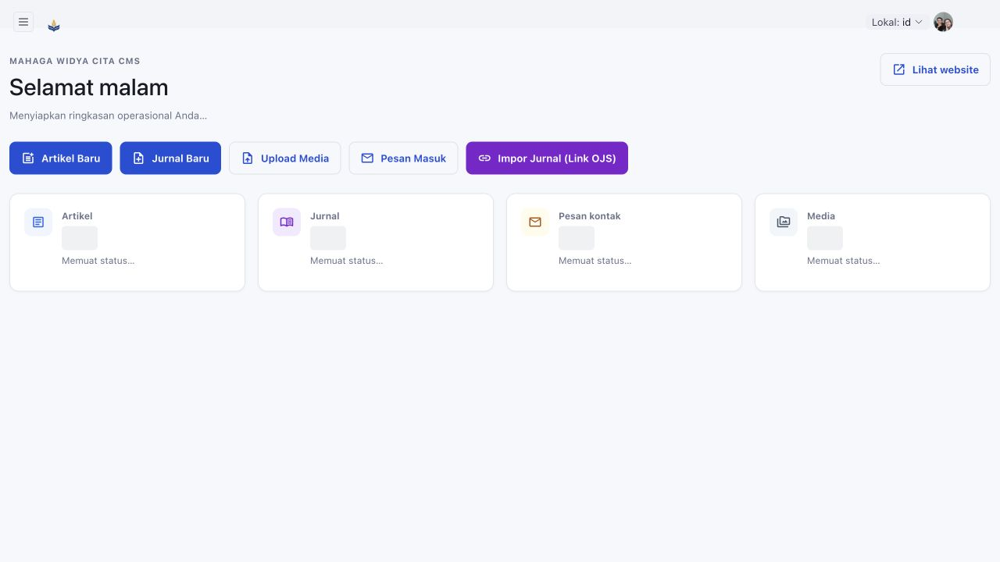

### Bagian-bagian Utama di Dashboard:

1. **Sapaan Personal & 3 Tombol Utama di Atas**:
   - **✍️ Tulis Berita Baru**: 1-klik untuk langsung membuka form artikel kosong.
   - **🌐 Lihat Website**: 1-klik untuk membuka website publik di tab baru guna melihat hasil perubahan.
   - **❓ Panduan Bantuan**: Membuka buku petunjuk interaktif langsung di layar Anda.
2. **Panduan 3 Langkah Pemula**:
   - Kotak petunjuk sederhana yang mengingatkan Anda bahwa Anda cukup menulis dalam bahasa Indonesia, dan sistem AI yang akan menerjemahkan ke bahasa Inggris secara otomatis.
3. **Pusat Kontrol Cepat (8 Kartu Visual)**:
   - Cukup klik salah satu kartu (misal: _Beranda_, _Tentang Kami_, _Layanan_, _Kontak_) untuk langsung mengedit halaman tersebut tanpa mencari-cari di menu.
4. **Data Statistik Lanjutan (Dapat Dilipat)**:
   - Grafik mingguan dan antrean sistem AI disimpan di dalam menu lipat agar tampilan dashboard tetap rapi dan tidak membingungkan.

---

## 4. Cara Menulis & Menerbitkan Berita Baru (1-Klik Publish)

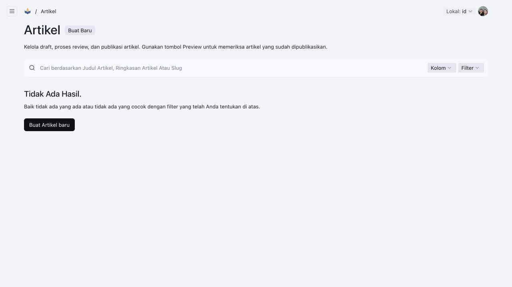

### Langkah Detail Menulis Artikel:

1. Klik tombol **✍️ Tulis Berita Baru** di pojok kanan atas Dashboard (atau pilih menu **Artikel Berita > Buat Baru**).
2. Pastikan pilihan bahasa di kanan atas adalah **`🇮🇩 Indonesia (Utama)`**.
3. Isi kolom yang tersedia:
   - **Judul Artikel**: Masukkan judul berita yang menarik.
   - **Isi Artikel**: Tulis isi berita menggunakan editor teks yang mirip dengan Microsoft Word (Anda bisa menebalkan teks, membuat daftar poin, dsb).
   - **Ringkasan Singkat**: Tulis 1–2 kalimat singkat (maksimal 320 huruf) yang merangkum berita tersebut.
   - **Kategori**: Pilih kategori berita yang sesuai (misal: Hukum, Kebijakan Publik, Riset).

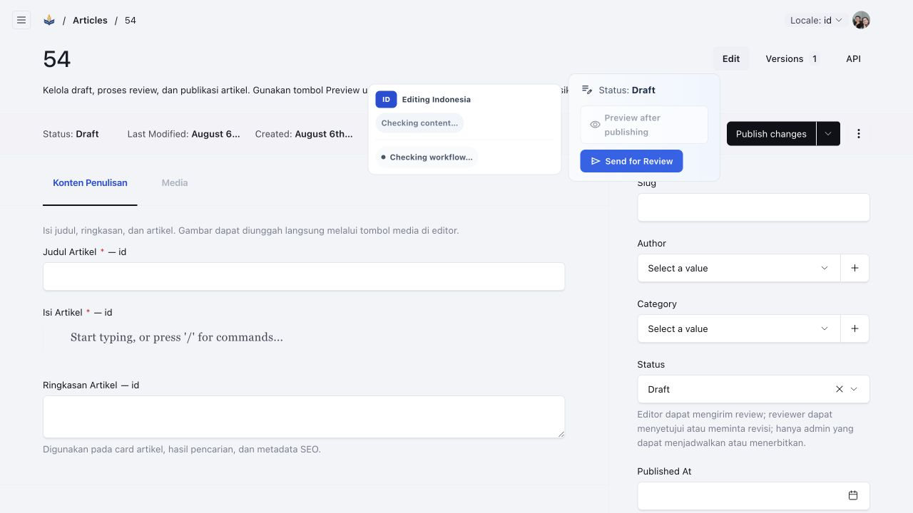

4. **Menambahkan Foto Berita**:
   - Buka tab **Media**.
   - Pada bagian **Gambar Utama**, klik **Pilih dari yang sudah ada** atau klik **Buat Baru** untuk mengunggah foto dari laptop Anda.
   - Isi teks penjelasan singkat gambar (_Alt Text_), misalnya: _"Suasana seminar hukum Mahaga Widya Cita"_.

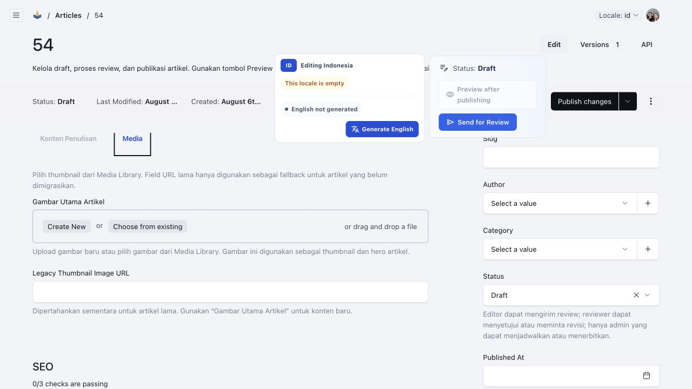

5. **Mempublikasikan ke Website (1-Klik)**:
   - Di bilah bawah layar, Anda akan melihat tombol tindakan.
   - Jika Anda ingin langsung menayangkan berita ke website, cukup klik **🚀 Publikasikan**.
   - Berita Anda kini resmi tayang di website publik!

> [!NOTE]
> **Penjelasan Status Berita**:
>
> - **Draf (Belum Tayang)**: Tulisan masih disimpan di admin dan belum dapat dibaca oleh umum.
> - **Tayang di Website (Published)**: Berita sudah tampil di halaman depan website.

---

## 5. Fitur Terjemahan Otomatis ke Bahasa Inggris (AI)

Website Mahaga Widya Cita berstandar internasional dan mendukung dua bahasa (**Indonesia** dan **Inggris**). Namun, Anda **TIDAK PERLU** repot-repot menerjemahkan teks sendiri secara manual!

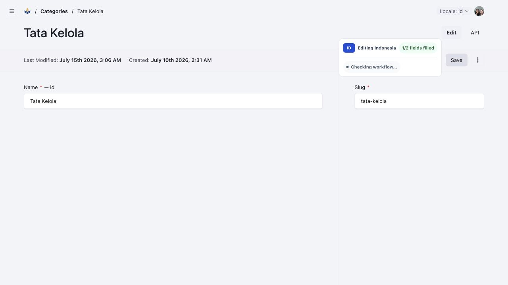

### Cara Kerja Terjemahan:

1. Tulis seluruh berita atau halaman dalam **Bahasa Indonesia**.
2. Saat Anda mengklik **Simpan** atau **Publikasikan**, sistem kecerdasan buatan (AI) secara otomatis menerjemahkan judul, ringkasan, dan isi berita ke dalam Bahasa Inggris yang baku.
3. Pengunjung website berbahasa asing yang memilih tombol **English** di website akan langsung membaca versi terjemahan tersebut.

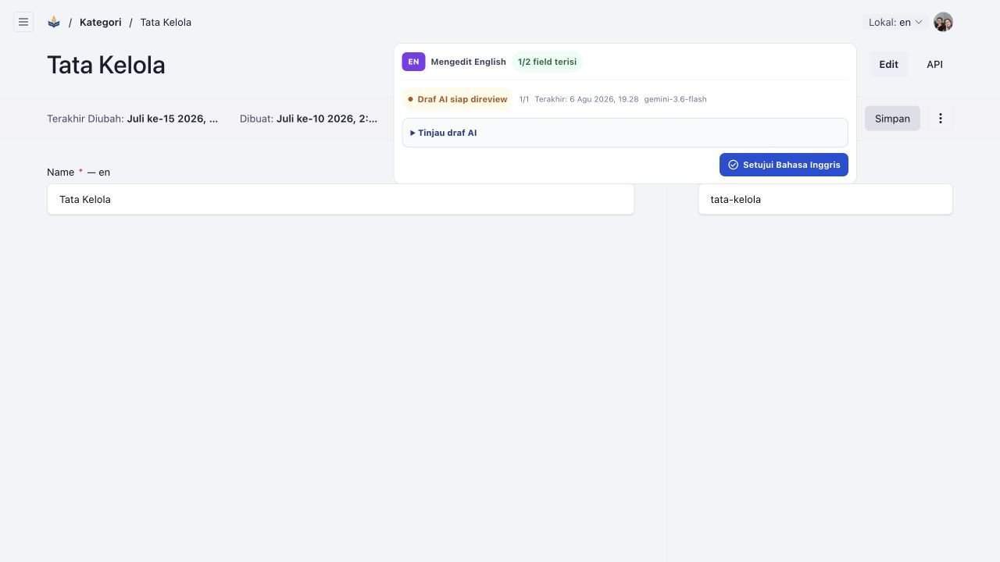

> [!TIP]
> **Ingin Memeriksa atau Mengubah Bahasa Inggrisnya?**
> Cukup ubah tombol bahasa di kanan atas dari `🇮🇩 Indonesia (Utama)` menjadi `🇬🇧 English`. Anda bisa membaca terjemahannya dan menyunting kata tertentu jika dirasa perlu.

---

## 6. Menambahkan & Mengimpor Jurnal Ilmiah

Untuk mempublikasikan jurnal hasil riset atau kajian hukum, Anda dapat melakukannya dengan 2 cara: **Input Manual** atau **Impor Cepat via Link OJS**.

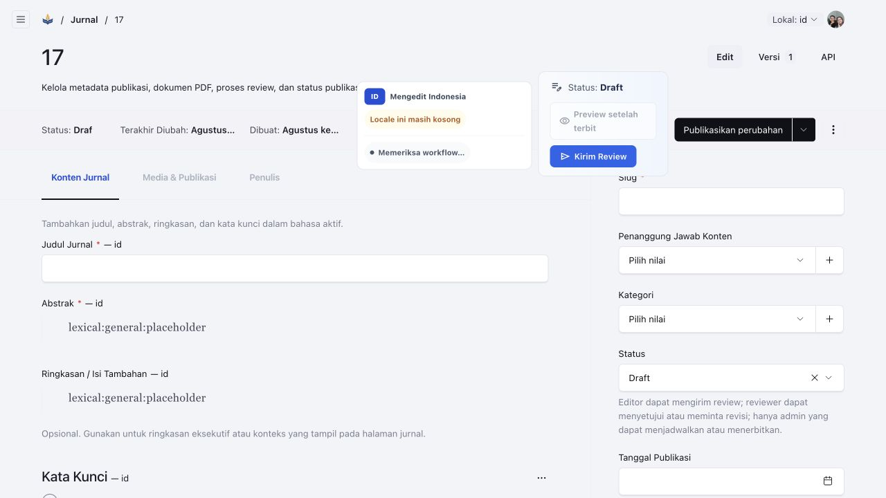

### Cara 1: Mengisi Jurnal Manual

1. Pilih menu **Publikasi & Berita > Jurnal Ilmiah > Buat Baru**.
2. Isi **Judul Jurnal**, **Abstrak**, dan tambahkan beberapa **Kata Kunci**.
3. Buka tab **Media & Publikasi**:
   - Unggah berkas **Dokumen Jurnal (PDF)** — berkas ini wajib agar pengunjung bisa mengunduh jurnal.
   - Isi informasi nomor terbitan: Tahun Terbit, Volume, Issue, dan DOI (jika ada).
4. Buka tab **Penulis**: Masukkan nama penulis dan institusi asalnya.
5. Klik **Publikasikan**.

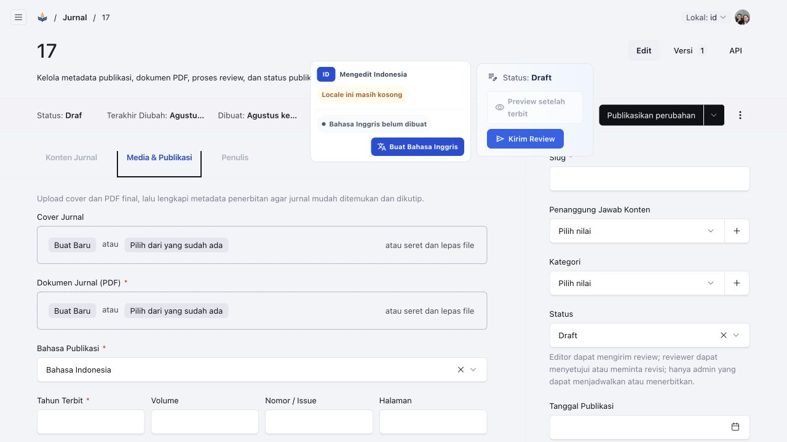

---

### Cara 2: Impor Otomatis Menggunakan Link Jurnal OJS (Sangat Praktis!)

Jika jurnal Anda sudah terdaftar di sistem jurnal online (OJS / Open Journal Systems):

1. Klik tombol **Impor Jurnal (Link OJS)** di Dashboard.
2. Tempel (_paste_) alamat URL artikel jurnal tersebut ke dalam kotak yang muncul.
3. Klik tombol **Mulai Impor**.
4. Sistem akan secara otomatis membaca dan menyalin Judul, Nama Penulis, Abstrak, Nomor Volume/Issue, dan nomor DOI!
5. Anda tinggal memeriksa ulang kelengkapannya, mengunggah berkas PDF, lalu klik **Publikasikan**.

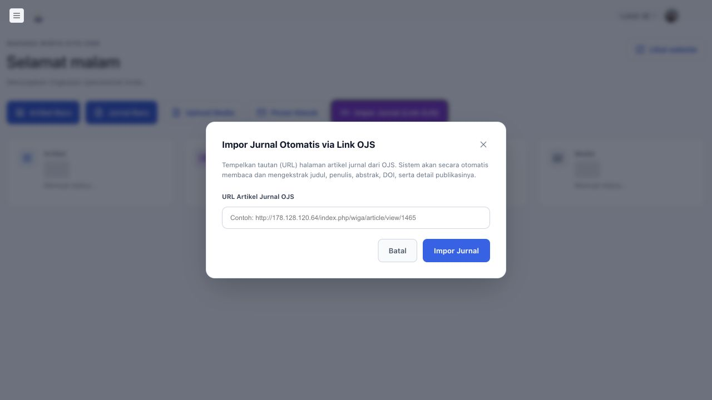

---

## 7. Mengedit Halaman Website

Anda dapat memperbarui teks dan foto pada setiap halaman perusahaan dengan memilih menu di kelompok **🌐 Halaman Website**:

### 1. Halaman Beranda Utama:

- Buka **Halaman Website > Beranda Utama**.
- Anda dapat mengubah teks slogan utama (_Hero Banner_), angka capaian statistik, logo mitra kerjasama, hingga tombol WhatsApp.

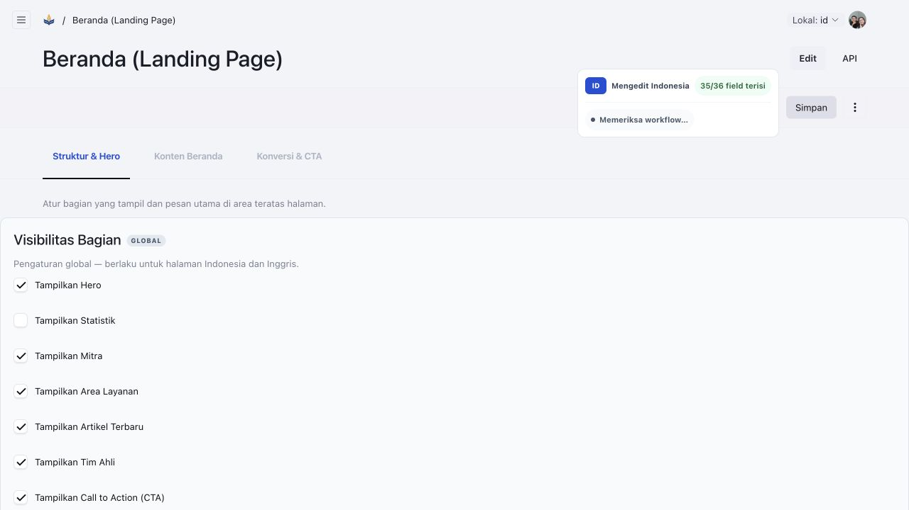

### 2. Halaman Tentang Kami:

- Buka **Halaman Website > Tentang Kami**.
- Anda bisa memperbarui narasi profil perusahaan, visi, misi, nilai-nilai budaya kerja, dan sambutan pimpinan.

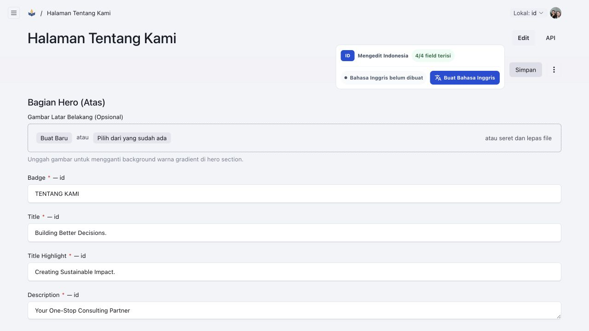

### 3. Halaman Kontak & Alamat:

- Buka **Halaman Website > Informasi Kontak**.
- Perbarui nomor WhatsApp kantor, alamat email resmi, alamat gedung kantor, jam operasional, maupun tautan peta Google Maps.

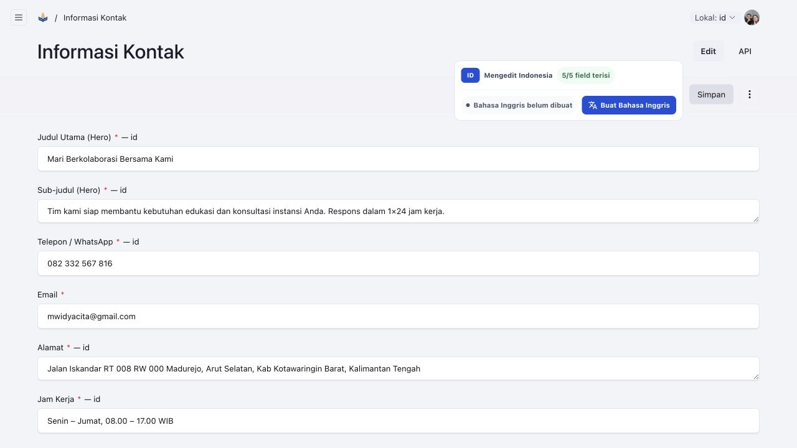

> [!IMPORTANT]
> **Jangan Lupa**: Setiap kali selesai mengubah teks atau foto di halaman website, klik tombol biru **Simpan Perubahan** di sudut kanan atas layar.

---

## 8. Menambahkan Anggota Tim Ahli & Konsultan

Untuk menampilkan profil pimpinan atau pakar konsultan di halaman tim:

1. Buka menu **Halaman Website > Tim Ahli & Konsultan > Buat Baru**.
2. Unggah foto formal anggota tim.
3. Masukkan **Nama Lengkap & Gelar**, **Inisial** (contoh: _MWC_), serta ringkasan biografi singkat.
4. Pilih kategori: **Management** (untuk direksi/manajemen) atau **Expert** (untuk konsultan ahli).
5. Tuliskan **Jabatan** atau **Instansi Asal**, serta **Bidang Keahlian** mereka.
6. Tentukan nomor urut tampil (angka lebih kecil akan muncul lebih awal di website).
7. Klik **Simpan**.

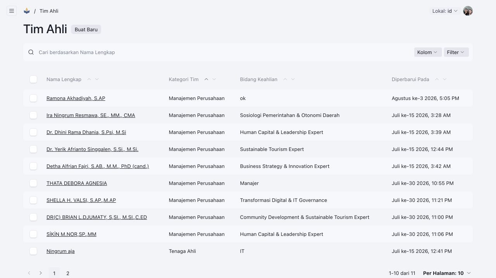
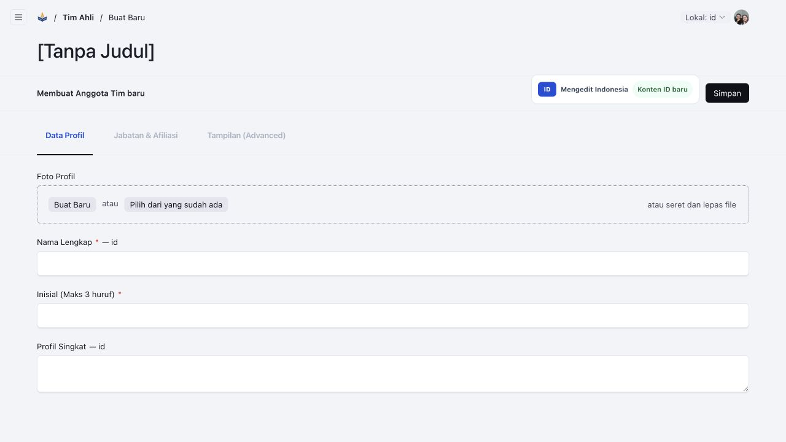

---

## 9. Mengunggah Foto & Galeri Media

Semua dokumen gambar dan PDF yang pernah diunggah akan tersimpan dengan rapi di perpustakaan media:

1. Buka menu **Publikasi & Berita > Galeri Foto & Media > Buat Baru**.
2. Seret (_drag & drop_) file foto dari laptop Anda ke dalam kotak abu-abu, atau klik untuk memilih file.
3. Beri teks deskripsi foto (_Alt Text_) agar mudah dicari di kemudian hari.
4. Klik **Simpan**. Foto tersebut kini siap digunakan di artikel berita, halaman layanan, maupun banner website.

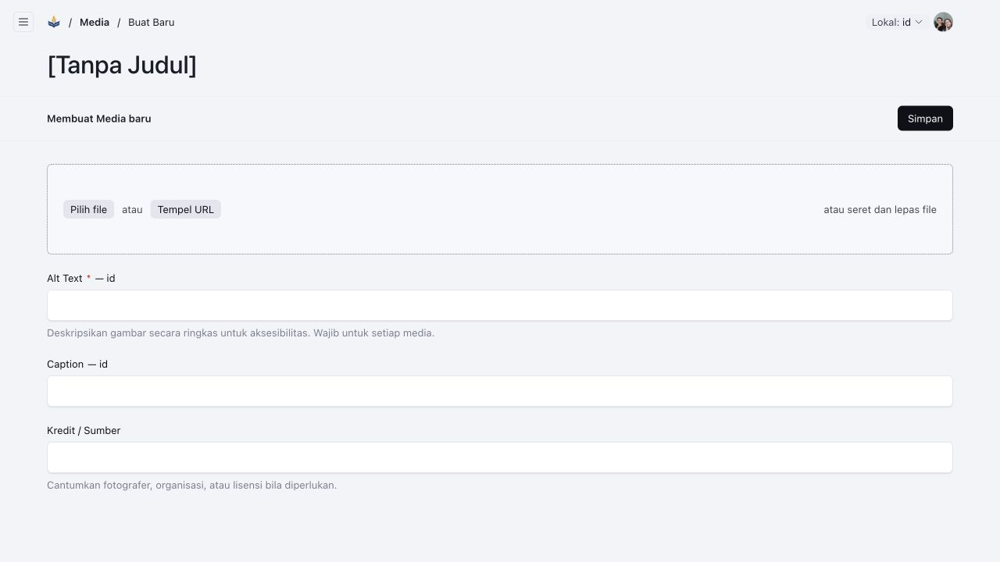

---

## 10. Melihat Pesan Masuk dari Pengunjung Website

Jika ada pengunjung website atau calon mitra yang mengisi formulir di halaman _Kontak_:

1. Buka menu **Pesan & Pengunjung > Pesan Masuk Formulir**.
2. Anda akan melihat daftar nama, alamat email, nomor telepon, instansi, dan subjek pesan yang dikirimkan.
3. Klik pada salah satu baris pesan untuk membaca isi pesan lengkapnya sehingga staf operasional dapat segera menindaklanjuti atau membalas lewat email/telepon.

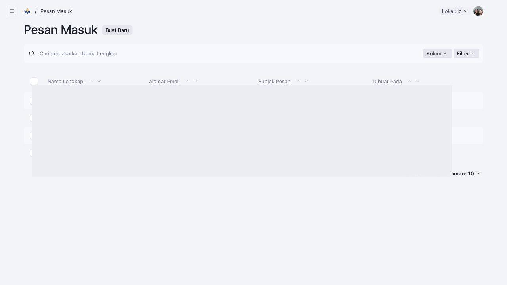

---

## 11. Pusat Bantuan & Tanya Jawab Pemula (FAQ)

Jika suatu saat Anda merasa bingung atau ragu saat mengoperasikan website, cukup klik tombol **❓ Panduan Bantuan** di sudut kanan atas Dashboard:

### Pertanyaan yang Paling Sering Diajukan (FAQ):

- **T: Apakah artikel yang saya simpan langsung muncul di website?**
  - **J**: Hanya jika statusnya **"Tayang di Website (Published)"**. Jika masih disimpan sebagai **"Draf (Belum Tayang)"**, artikel belum dapat dilihat oleh publik sehingga Anda bisa bebas mengoreksinya terlebih dahulu.
- **T: Bagaimana jika ada kata yang salah ketik setelah artikel terbit?**
  - **J**: Jangan panik! Buka kembali artikel tersebut, perbaiki ketikan yang salah, lalu klik **Simpan**. Perubahan akan langsung terupdate saat itu juga di website.
- **T: Apakah saya wajib menulis artikel dalam bahasa Inggris juga?**
  - **J**: Tidak wajib. Anda cukup menulis dalam bahasa Indonesia yang baik dan benar. Sistem AI akan otomatis menerjemahkan artikel ke dalam bahasa Inggris di latar belakang.
- **T: Bagaimana cara melihat hasil tampilan artikel di website asli?**
  - **J**: Klik tombol **Lihat Website** atau klik ikon pratinjau di baris artikel untuk langsung membuka halaman publiknya.

---

### Ringkasan Tips Singkat:

1. **Bahasa**: Selalu pastikan memilih `🇮🇩 Indonesia (Utama)` saat menulis atau mengedit teks baru.
2. **Gambar**: Gunakan gambar yang jelas dan berformat `.jpg` atau `.png` dengan ukuran di bawah 5 MB.
3. **Dokumen Jurnal**: Pastikan format file berkas jurnal adalah `.pdf`.
4. **Selesai Bekerja**: Selalu pastikan perubahan disimpan sebelum menutup tab browser.
