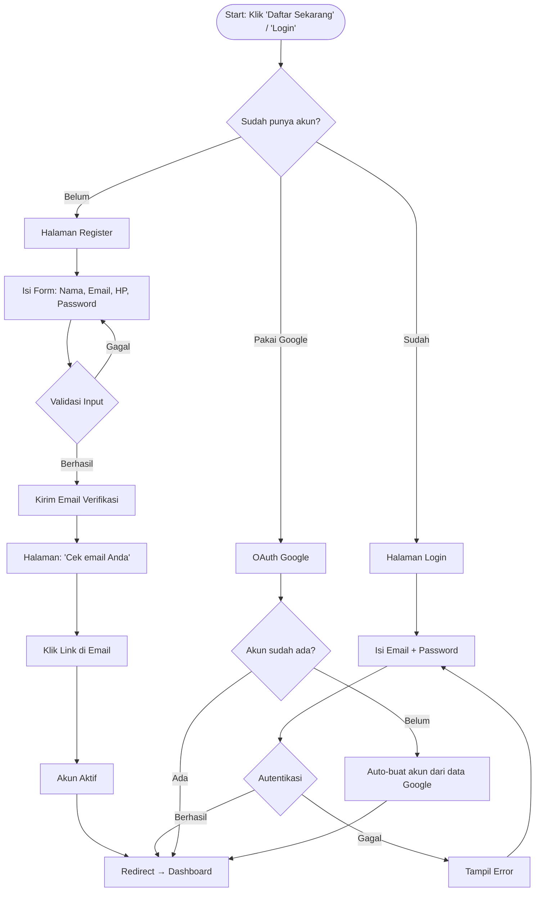
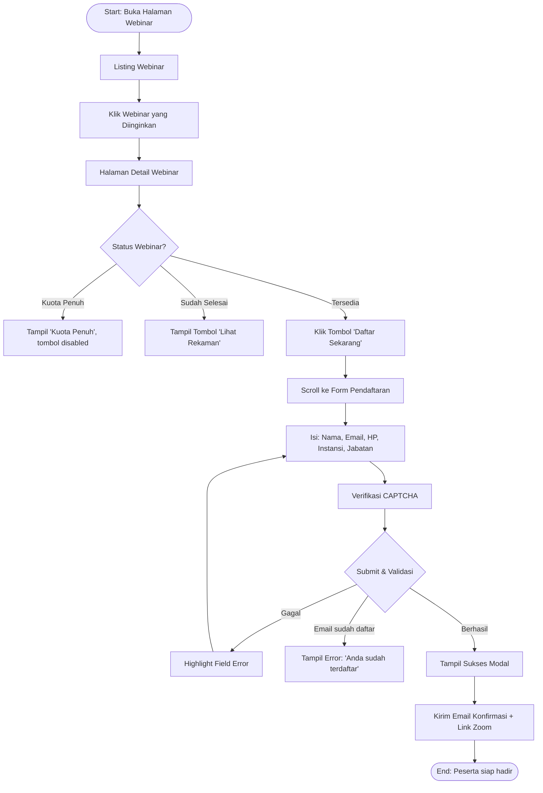
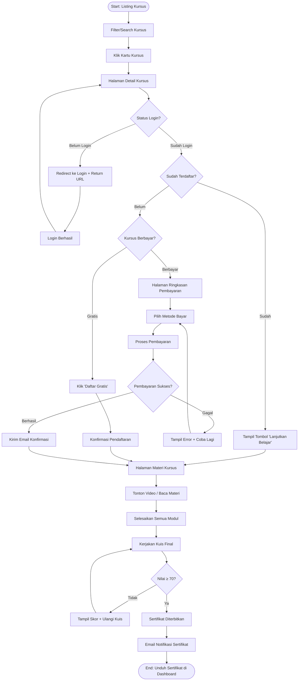
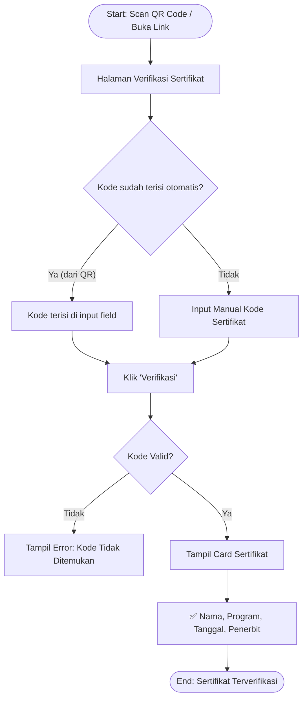
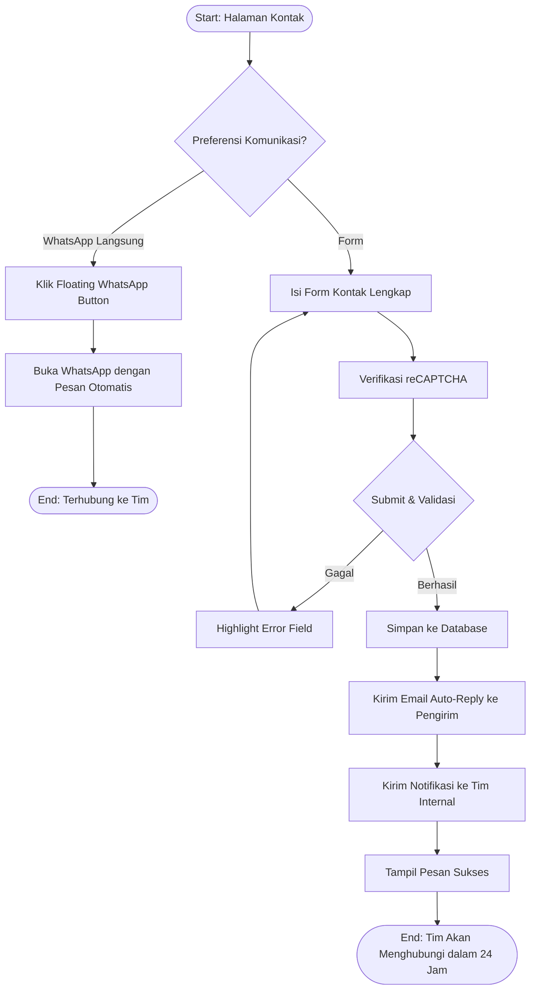

# UI/UX Flow Design — PT Mahaga Widya Cita

**Versi:** 1.0.0  
**Tanggal:** 9 Juli 2026  
**Metodologi:** User-Centered Design (UCD)

---

## 1. Peta Navigasi (Navigation Map)

```mermaid
graph TD
    Home["🏠 Homepage"]

    Home --> About["📋 Tentang Kami"]
    About --> AboutUs["Profil Perusahaan"]
    About --> Management["Manajemen"]
    About --> Expert["Tenaga Ahli"]
    About --> Partner["Mitra"]
    About --> CEO["Pesan CEO"]

    Home --> Services["⚙️ Layanan Kami"]
    Services --> Consulting["Smart Consulting"]
    Services --> ExecEdu["Smart Executive Education"]
    Services --> Software["Smart Software Service"]
    Services --> GovReview["Smart Governance Review"]
    Services --> OnlineCourse["Smart Online Course"]
    Services --> DigConf["Smart Digital Conference"]

    Home --> Webinar["🎙️ Webinar / SDS"]
    Home --> Course["📚 Kursus Online"]
    Home --> Article["📰 Artikel"]
    Article --> Individu["Untuk Individu"]
    Article --> Bisnis["Untuk Bisnis"]
    Article --> Govt["Untuk Pemerintah"]
    Article --> Policy["Policy Review"]

    Home --> Career["💼 Karir"]
    Home --> Contact["📞 Kontak"]
    Home --> Auth["🔐 Login / Register"]
    Auth --> Dashboard["📊 Dashboard"]
    Dashboard --> MyProfile["Profil Saya"]
    Dashboard --> MyCourses["Kursus Saya"]
    Dashboard --> MyWebinars["Webinar Saya"]
    Dashboard --> MyCerts["Sertifikat Saya"]
```



---

## 2. User Journey Map

### 2.1 Persona: ASN yang Ingin Ikut Webinar

| Tahap | Tindakan | Touchpoint | Emosi | Pain Point | Opportunity |
|---|---|---|---|---|---|
| **1. Sadar** | Menerima broadcast WhatsApp tentang SDS #27 | Link WhatsApp, poster | 😐 Netral | Informasi tersebar tidak terstruktur | CTA tombol langsung ke halaman webinar |
| **2. Tertarik** | Membuka website, melihat detail webinar | Halaman detail webinar | 😊 Penasaran | Ingin tahu narasumber & topik lebih dalam | Tampilkan profil narasumber dengan jelas |
| **3. Mendaftar** | Mengisi form pendaftaran | Form pendaftaran webinar | 😅 Sedikit ribet | Form terlalu panjang | Minimalisir field, max 5 input |
| **4. Konfirmasi** | Menerima email + link Zoom | Email inbox | 😊 Lega | Email masuk spam | Panduan "Tambahkan ke Kontak" |
| **5. Hadir** | Mengikuti webinar | Zoom/YouTube | 🤩 Antusias | Tidak bisa bertanya langsung | Chat Q&A terintegrasi |
| **6. Sertifikat** | Menerima email sertifikat | Email + Dashboard | 🥳 Puas | Tidak tahu cara download | Tombol download yang jelas di email |
| **7. Loyal** | Mendaftar webinar berikutnya | Homepage, notifikasi | 😍 Setia | Lupa jadwal berikutnya | Newsletter / reminder otomatis |

---

### 2.2 Persona: Pimpinan Instansi yang Cari Layanan Konsultasi

| Tahap | Tindakan | Touchpoint | Emosi | Pain Point | Opportunity |
|---|---|---|---|---|---|
| **1. Sadar** | Mencari vendor konsultasi di Google | Google Search | 😐 Netral | Banyak pilihan tidak jelas | SEO optimal, tampil di halaman 1 |
| **2. Evaluasi** | Buka halaman layanan konsultasi | Halaman layanan | 🧐 Kritis | Tidak ada bukti portofolio | Tampilkan case study dan logo klien |
| **3. Cek Kredensial** | Lihat profil tim & manajemen | Halaman tim | 😊 Mulai yakin | Gelar akademis sulit dibaca di mobile | Desain kartu tim yang bersih |
| **4. Hubungi** | Isi form kontak / klik WhatsApp | Halaman kontak | 😅 Berharap cepat direspons | Khawatir tidak direspons | Auto-reply email + janji respon 24 jam |
| **5. Follow-up** | Menerima email atau panggilan dari tim | Email / Telepon | 😊 Dihargai | — | CRM internal untuk track leads |

---

## 3. Screen Flow Diagram

### 3.1 Alur Registrasi & Login



---

### 3.2 Alur Pendaftaran Webinar (Guest — Tanpa Login)



---

### 3.3 Alur Kursus Online (Pengguna Terdaftar)



---

### 3.4 Alur Verifikasi Sertifikat (Publik)



---

### 3.5 Alur Form Kontak & Lead



---

## 4. Wireframe Description (Per Halaman)

### 4.1 Homepage

```
┌──────────────────────────────────────────────────────┐
│ [LOGO] [Nav: Tentang | Layanan | Webinar | Artikel | Karir | Kontak] [Masuk] [Daftar] │
├──────────────────────────────────────────────────────┤
│                                                      │
│   ┌─────────────────────────────────────────────┐   │
│   │  HERO SECTION                               │   │
│   │  [Headline Besar H1]                        │   │
│   │  [Subheadline paragraph]                    │   │
│   │  [Btn: Lihat Layanan] [Btn: Hubungi Kami]   │   │
│   │                          [Ilustrasi/Video]  │   │
│   └─────────────────────────────────────────────┘   │
│                                                      │
│   STATS ROW: [500+ Webinar] [10K+ Peserta] [200+ Instansi] [50+ Mitra] │
│                                                      │
│   OUR SERVICES (Grid 3×2)                           │
│   ┌──────┐ ┌──────┐ ┌──────┐                       │
│   │ [ikon]│ │ [ikon]│ │ [ikon]│                     │
│   │Konsult│ │ Eduka│ │Softwr│                       │
│   └──────┘ └──────┘ └──────┘                       │
│   ┌──────┐ ┌──────┐ ┌──────┐                       │
│   │ [ikon]│ │ [ikon]│ │ [ikon]│                     │
│   │GovRev │ │Course│ │ Conf │                       │
│   └──────┘ └──────┘ └──────┘                       │
│                                                      │
│   UPCOMING WEBINAR (Card horizontal)                │
│   ┌────────────────────────────────────────────┐   │
│   │[Poster]│ SDS #27 | 15 Juli 2026            │   │
│   │        │ Topik: Reformasi Birokrasi         │   │
│   │        │ [Btn: Daftar Sekarang]             │   │
│   └────────────────────────────────────────────┘   │
│                                                      │
│   LATEST ARTICLES (Grid 3 Kolom)                   │
│   ┌──────┐ ┌──────┐ ┌──────┐                       │
│   │[Thumb]│ │[Thumb]│ │[Thumb]│                    │
│   │ Judul │ │ Judul │ │ Judul │                    │
│   │ ••••• │ │ ••••• │ │ ••••• │                    │
│   └──────┘ └──────┘ └──────┘                       │
│                                                      │
│   OUR TEAM CAROUSEL                                 │
│   ← [Foto] [Foto] [Foto] [Foto] →                  │
│      Nama    Nama    Nama    Nama                   │
│      Jabatan Jabatan Jabatan Jabatan                │
│                                                      │
│   PARTNERS LOGO STRIP (auto-scroll)                 │
│   [Logo] [Logo] [Logo] [Logo] [Logo] [Logo]         │
│                                                      │
│   CTA BANNER                                        │
│   ┌────────────────────────────────────────────┐   │
│   │ "Siap Transformasi Digital Instansi Anda?" │   │
│   │ [Btn: Konsultasi Gratis via WhatsApp]       │   │
│   └────────────────────────────────────────────┘   │
│                                                      │
├──────────────────────────────────────────────────────┤
│ FOOTER [Logo | Nav | Kontak | Sosmed | Newsletter]  │
└──────────────────────────────────────────────────────┘
```

---

### 4.2 Halaman Detail Webinar

```
┌──────────────────────────────────────────────────────┐
│ [NAVBAR]                                            │
├──────────────────────────────────────────────────────┤
│ Breadcrumb: Home > Webinar > SDS #27 Tahun 2026     │
│                                                      │
│ ┌────────────────────────────┐ ┌──────────────────┐ │
│ │ [POSTER WEBINAR - Besar]   │ │ SIDEBAR PENDAFT. │ │
│ │                            │ │ ┌──────────────┐ │ │
│ │ 🔴 GRATIS | SERTIFIKAT    │ │ │ 15 Juli 2026 │ │ │
│ │                            │ │ │ 09.00 WIB    │ │ │
│ │ [BADGE: Pendaftaran Buka]  │ │ │ Platform:Zoom│ │ │
│ │                            │ │ │ Kuota: 266/500│ │ │
│ └────────────────────────────┘ │ │              │ │ │
│                                │ │[DAFTAR GRATIS]│ │ │
│ TENTANG WEBINAR               │ └──────────────┘ │ │
│ ─────────────────             │                  │ │
│ Deskripsi topik & manfaat...  │ NARASUMBER       │ │
│                               │ ┌──────────────┐ │ │
│ AGENDA                        │ │[Foto] Dr. X  │ │ │
│ 09.00 - Pembukaan             │ │ Jabatan      │ │ │
│ 09.15 - Pemaparan Materi      │ └──────────────┘ │ │
│ 10.00 - Q&A                   │                  │ │
│ 11.00 - Penutupan             │ BAGIKAN          │ │
│                               │ [WA] [LI] [TW]  │ │
│ FORM PENDAFTARAN              └──────────────────┘ │
│ ┌──────────────────────────────────────────────┐   │
│ │ Nama Lengkap: [________________]             │   │
│ │ Email:        [________________]             │   │
│ │ No. HP:       [________________]             │   │
│ │ Instansi:     [________________]             │   │
│ │ Jabatan:      [________________]             │   │
│ │                  [✓ Captcha] [DAFTAR →]     │   │
│ └──────────────────────────────────────────────┘   │
├──────────────────────────────────────────────────────┤
│ [FOOTER]                                            │
└──────────────────────────────────────────────────────┘
```

---

### 4.3 Dashboard Pengguna

```
┌──────────────────────────────────────────────────────┐
│ [NAVBAR — Authenticated: Avatar + Nama User + ▼]    │
├────────────────┬─────────────────────────────────────┤
│ SIDEBAR        │ KONTEN UTAMA                        │
│ ──────────     │ ─────────────────────────────────── │
│ 👤 Profil Saya│ Selamat datang, Budi! 👋             │
│ 📚 Kursus Saya│                                      │
│ 🎙 Webinar    │ STATISTIK SAYA                       │
│ 🏆 Sertifikat │ ┌──────┐ ┌──────┐ ┌──────┐          │
│                │ │  3   │ │  12  │ │  2   │          │
│                │ │Kursus│ │Webinr│ │Sertif│          │
│                │ └──────┘ └──────┘ └──────┘          │
│                │                                      │
│                │ KURSUS AKTIF                         │
│                │ ┌────────────────────────────────┐  │
│                │ │[Thumb] APBD Berbasis Kinerja    │  │
│                │ │ ████████░░░░░░  60% selesai    │  │
│                │ │ [Lanjutkan Belajar →]           │  │
│                │ └────────────────────────────────┘  │
│                │                                      │
│                │ WEBINAR MENDATANG                    │
│                │ ┌────────────────────────────────┐  │
│                │ │ 🗓 15 Juli 2026 | SDS #27      │  │
│                │ │ Link Zoom: [Klik untuk bergabung]│  │
│                │ └────────────────────────────────┘  │
│                │                                      │
│                │ SERTIFIKAT TERBARU                   │
│                │ ┌────────────────────────────────┐  │
│                │ │ 🏆 SAKIP & LAKIP 2025          │  │
│                │ │ Diterbitkan: 1 Juli 2026        │  │
│                │ │ Kode: MWC-2025-WEB021-BUD      │  │
│                │ │ [Unduh PDF] [Verifikasi]        │  │
│                │ └────────────────────────────────┘  │
├────────────────┴─────────────────────────────────────┤
│ [FOOTER — minimal]                                  │
└──────────────────────────────────────────────────────┘
```

---

## 5. Design System Token

### 5.1 Palet Warna

| Token | Hex | Penggunaan |
|---|---|---|
| `--color-primary-900` | `#0B2D6B` | Navbar, heading utama |
| `--color-primary-700` | `#1247A8` | Teks link aktif |
| `--color-primary-500` | `#1E6FD9` | Tombol utama, aksen |
| `--color-primary-100` | `#DBEAFE` | Background section alternating |
| `--color-gold-500` | `#C9970A` | Badge premium, highlight |
| `--color-success` | `#16A34A` | Status sukses, badge tersedia |
| `--color-warning` | `#D97706` | Status pending, peringatan |
| `--color-danger` | `#DC2626` | Error, kuota penuh |
| `--color-neutral-900` | `#1A1A2E` | Teks utama |
| `--color-neutral-500` | `#6B7280` | Teks sekunder |
| `--color-neutral-100` | `#F4F6FA` | Background section |
| `--color-white` | `#FFFFFF` | Background kartu |

---

### 5.2 Tipografi

| Token | Font | Size | Weight | Penggunaan |
|---|---|---|---|---|
| `--text-display` | Plus Jakarta Sans | 48–64px | 800 | Hero headline |
| `--text-h1` | Plus Jakarta Sans | 36–40px | 700 | Judul halaman |
| `--text-h2` | Plus Jakarta Sans | 28–32px | 700 | Judul seksi |
| `--text-h3` | Plus Jakarta Sans | 20–24px | 600 | Subjudul, kartu |
| `--text-body-lg` | Inter | 18px | 400 | Paragraf utama |
| `--text-body` | Inter | 16px | 400 | Konten umum |
| `--text-body-sm` | Inter | 14px | 400 | Label, metadata |
| `--text-caption` | Inter | 12px | 400 | Caption, footnote |

---

### 5.3 Komponen UI

| Komponen | Variasi | State |
|---|---|---|
| **Button** | Primary, Secondary, Outline, Ghost, Danger | Default, Hover, Active, Disabled, Loading |
| **Input** | Text, Email, Password, Textarea, Select, File | Default, Focus, Error, Disabled |
| **Badge** | Color: Blue, Green, Yellow, Red, Gray | Static |
| **Card** | Default, Hover-elevated, Featured | Default, Hover |
| **Modal** | Small, Medium, Large | Open, Close |
| **Toast** | Success, Error, Warning, Info | Auto-dismiss 4s |
| **Progress Bar** | Linear, Circular | Animated |
| **Avatar** | Small (32px), Medium (48px), Large (64px) | Image, Initials |
| **Tabs** | Underline, Pill | Active, Inactive |
| **Dropdown** | Select, Menu | Open, Closed |

---

### 5.4 Spacing & Layout

| Token | Value | Penggunaan |
|---|---|---|
| `--spacing-xs` | 4px | Gap antar elemen kecil |
| `--spacing-sm` | 8px | Padding dalam komponen kecil |
| `--spacing-md` | 16px | Padding standar |
| `--spacing-lg` | 24px | Gap antar komponen |
| `--spacing-xl` | 32px | Margin antar seksi |
| `--spacing-2xl` | 48px | Padding seksi besar |
| `--spacing-3xl` | 64px | Margin antar seksi besar |
| `--container-max` | 1280px | Max width konten |
| `--container-padding` | 24px | Padding kiri-kanan di mobile |

---

## 6. Breakpoint Responsif

| Breakpoint | Lebar | Deskripsi |
|---|---|---|
| `xs` | 0–360px | Small mobile |
| `sm` | 361–640px | Mobile |
| `md` | 641–768px | Tablet portrait |
| `lg` | 769–1024px | Tablet landscape |
| `xl` | 1025–1280px | Desktop |
| `2xl` | 1281px+ | Wide desktop |

**Perubahan Layout per Breakpoint:**
- **Mobile (< 768px):** Single column, hamburger menu, bottom-sticky CTA button
- **Tablet (768–1024px):** 2-column grid, sidebar menjadi tab navigasi
- **Desktop (> 1024px):** Full layout 3-column grid, sidebar fixed

---

## 7. Micro-Animations Spec

| Elemen | Animasi | Durasi | Easing |
|---|---|---|---|
| Navbar scroll | Background fade in | 200ms | ease |
| Hero headline | Slide up + fade in | 600ms | ease-out |
| Section masuk viewport | Fade in + slide up (24px) | 400ms | ease-out |
| Kartu hover | Elevasi shadow + lift Y(-4px) | 200ms | ease |
| Tombol hover | Scale(1.02) + brightness | 150ms | ease |
| Stats counter | Count-up animation | 1500ms | ease-out |
| Modal open | Scale(0.9→1) + opacity | 250ms | ease-out |
| Toast notification | Slide in dari kanan | 300ms | spring |
| Progress bar fill | Linear fill | 800ms | ease-out |
| Page transition | Fade in | 300ms | ease |
